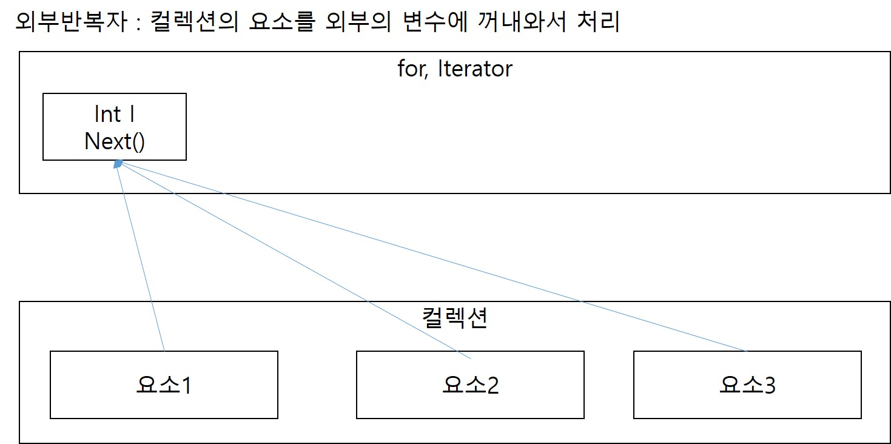
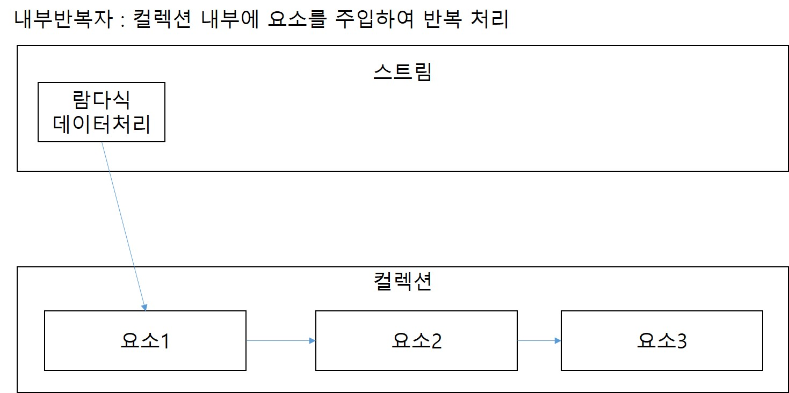

# 1. 스트림
## 1. 스트림이란
1. 스트림은 컬렉션이나 배열의 요소를 반복하여 처리하기 위한 방식 중 하나이다.
2. 컬렉션에 .stream() 메소드를 가지고 있어서 컬렉션을 스트림형식으로 변경해서 사용할 수 있다.

## 2. 스트림 선언
1. 컬렉션<타입> list => 
        Strema<타입> typeStream = list.stream();

## 3. 스트림의 forEach
1. 람다식으로 구현해한다.
2. typeStream.forEach(컬렉션의 요소 한개를 담을 변수명 -> 
                                            {처리할 내용})
3. 내부반복자여서 처리속도가 Iterator보다 빠르다.
4. 람다식으로 다양한 요소를 처리할 수 있다.
5. 중간처리, 최종처리를 수행하도록 파이프 라인(체이닝기법)을 형성할 수 있다.

## 4. 내부반복자
1. for나 Iterator는 컬렉션의 요소를 외부로 꺼내서 사용하는 외부반복자.
2. 스트림은 요소를 컬렉션 내부로 넣어서 반복 처리하는 내부 반복자.
3. 
4. 

## 5. 스트림을 연결하여 파이프라인 만들기
1. 스트림 하나이상 연결할 수 있다. 원본 스트림의 필터링된 중간 스트림이 연결될 수 있고 그 후에 매핑 스트림으로 타입을 변경한 스트림이 연결될 수도 있다. 마지막에 최종처리를 해주는 스트림이 연결돼서 파이프라인을 구성할 수 있다.
2. 현대차 스트림 -> 아반떼 모델만 남은 스트림 -> 가격 -> 총 가격출력
  Stream<HyundaiCar> -> 멤버변수인 model=아반떼 -> Stream<Integer>
3. 체이닝기법
- int 총 가격 = list<HyundaiCar>.stream()
                               .mapToInt(hCar -> hCar.getPrice())
                               .sum();
- 메소드의 호출을 연결해서 여러개의 메소드를 호출하는 방식
- 파이프라인을 구성할 때 체이닝기법을 사용하면 더 편리하게 파이프라인을 구성할 수 있다.
- 체이닝기법을 사용해서 파이프라인을 구성할 때 주의할 점은 최종 처리가 없으면 중간 처리까지의 체이닝기법이 동작하지 않는다.

## 6. 스트림에서 자주 쓰는 메소드
1. Stream<type> stream.(void)<b>forEach</b>(type의 값을 주입할 변수명(원하는대로 정한다.) -> 실행코드) : Stream에 담겨있는 <type>의 요소를 순회하면서(하나씩 접근) 실행코드를 요소의 개수만큼 반복실행. 리턴타입이 void라 리턴할 수 없다.
2. Stream<type> stream.(Stream<type>)<b>map</b>(type의 값을 주입할 변수명(원하는대로 정한다.) -> 새로운 스트림을 만들어줄 실행코드) : Stream에 담겨있는 <type>의 요소를 순회하면서(하나씩 접근) 실행코드에서 나온 결과값으로 새로운 스트림을 생성해서 리턴
3. Stream<type> stream.(Stream<type>)<b>filter</b>(type의 값을 주입할 변수명(원하는대로 정한다.) -> 조건코드) : 변수명 담긴 요소를 조건코드로 검사한다. true가 나오는 요소들만 다시 스트림으로 묶어서 리턴.
4. Stream<type> stream.(Stream<type>)<b>reduce</b>((결과값의 타입 변수명, type의 변수명) -> 어떻게 결과 값을 만들지) : 스트림을 하나의 결과값으로 만들어주는 메소드

## 7. 스트림 얻는 방법
1. 컬렉션에서 스트림 얻기
    - List<T>, Set<T> => stream(), parallelStream() => Stream<T>
2. 배열
    - Arrays.stream(T[]), Stream.of(T[]) => Stream<T>
    - Arrays.stream(int[]), IntStream.of(int[]) => IntStream
    - Arrays.stream(long[]), LongStream.of(long[]) => LongStream
    - Arrays.stream(double[]), DoubleStream.of(double[]) => DoubleStream
3. Files 클래스에서 얻기
    - Files.list(Path) => Stream<Path>
    - Files.lines(Path, Charset) => Stream<String> : 텍스트파일의 데이터를 행으로 나눠서 행들의 스트림으로 생성
4. Random 클래스에서 얻기
    - Random.doubles(...) => DoubleStream
    - Random.ints(...) => IntStream
    - Random.longs(...) => LongStream

## 8. 그외의 메소드
1. dinstinct() : 중복 제거. 객체는 equals가 true로 나오는 중복된 객체를 제거한다. 일반 값들은 같은 값이면 제거
2. mapToInt, Long, Double : IntStream, LongStream, DoubleStream으로 변환해주는 메소드
3. IntStream.asLongStream() -> LongStream
4. IntStream, LongStream.asDoubleStream() -> DoubleStream
5. IntStream              => Stream<Integer>  
   LongStream    .boxed() => Stream<Long>  
   DoubleStream           => Stream<Double>  